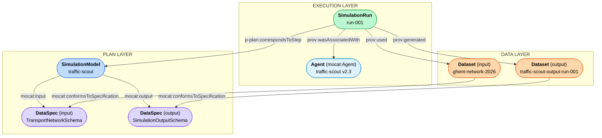

# Traffic Scout — End-to-End Scenario

## Use case

**Traffic Scout** is a simulation model developed by Transport and Mobility Leuven (TML)
that combines an interactive map and a simulation tool to provide insight into local traffic
flows. It is based on Telraam data, traffic indicators, geodata, and OpenStreetMap.
The model supports near-synchronous calculations at the meso-level (municipality, district,
neighbourhood), including network changes.

This example documents a single simulation run over the Ghent transport network on 2026-06-01,
using MoCAT's three-layer model to capture the plan, the execution, and the data artefacts.

---

## Three-layer structure

---

## Plan layer

### SimulationModel — `omg-simulationmodel:traffic-scout`

The model is typed as `mocat:SimulationModel` (which implies `prov:Plan`, `p-plan:Plan`,
and `p-plan:Step`). It carries DCAT metadata (title, description, keywords, publisher,
issued, modified) and declares its expected inputs and outputs via `mocat:input` and
`mocat:output`.

| Property | Value |
|----------|-------|
| `dcterms:title` | "Traffic Scout" |
| `dcterms:publisher` | Transport and Mobility Leuven |
| `dcterms:issued` | 2020-03-15 |
| `mocat:input` | `omg-schema:TransportNetworkSchema` |
| `mocat:output` | `omg-schema:SimulationOutputSchema` |

### DataSpecification — `omg-schema:TransportNetworkSchema`

Describes the required structure of the input dataset. Typed as `mocat:DataSpecification`
(a `p-plan:Variable`). Domain data validation is expressed via `sh:node` links to SHACL
NodeShapes.

| Shape | Target class | Key constraints |
|-------|-------------|-----------------|
| `omg-shacl:TransportVertexShape` | `ex:TransportVertex` | `ex:geom` (WKT, exactly 1) |
| `omg-shacl:TransportEdgeShape` | `ex:TransportEdge` | `ex:length` (double, 1), `ex:source`/`ex:sink` (vertex, 1), `ex:geom` (WKT, 1) |

### DataSpecification — `omg-schema:SimulationOutputSchema`

Describes the structure of the output dataset.

| Shape | Target class | Key constraints |
|-------|-------------|-----------------|
| `omg-shacl:SimulationOutputShape` | `ex:TrafficFlowResult` | `ex:roadSegmentId` (string, 1), `ex:vehicleCount` (integer, 1) |

---

## Execution layer

### Agent — `omg-agent:traffic-scout-v2-3`

Typed as `mocat:Agent` (which implies `prov:SoftwareAgent` and `spdx-sw:Package`).
SPDX metadata enables reproducibility: the exact package version and download location
are recorded so any run can be re-executed with the identical software.

| Property | Value |
|----------|-------|
| `foaf:name` | "Traffic Scout" |
| `spdx-sw:packageVersion` | "2.3.0" |
| `spdx-sw:packageUrl` | `pkg:github/tml-leuven/traffic-scout@2.3.0` |
| `spdx-sw:downloadLocation` | GitHub release v2.3.0 |
| `spdx-sw:primaryPurpose` | `spdx-purpose:application` |

### SimulationRun — `omg-simulationrun:run-001`

Typed as `mocat:SimulationRun` (which implies `prov:Activity` and `p-plan:Activity`).
Links back to the model via `p-plan:correspondsToStep` and to the software agent via
`prov:wasAssociatedWith`.

| Property | Value |
|----------|-------|
| `p-plan:correspondsToStep` | `omg-simulationmodel:traffic-scout` |
| `sosa:usedProcedure` | `omg-simulationmodel:traffic-scout` (SOSA compatibility) |
| `prov:wasAssociatedWith` | `omg-agent:traffic-scout-v2-3` |
| `prov:startedAtTime` | 2026-06-01T00:00:00Z |
| `prov:endedAtTime` | 2026-06-01T00:12:59Z |
| `prov:used` | `omg-dataset:ghent-network-2026` (input) |
| `prov:generated` | `omg-dataset:traffic-scout-output-run-001` (output) |

---

## Data layer

### Input dataset — `omg-dataset:ghent-network-2026`

The routable transport network for the Ghent region, derived from OpenStreetMap.
Carries a SHA-256 content hash via `spdx-core:verifiedUsing` to guarantee reproducibility.
The dataset is linked to its specification via both `mocat:conformsToSpecification`
(MoCAT-specific) and `p-plan:correspondsToVariable` (P-PLAN standard).

**Key invariant**: this dataset is consumed by `run-001` via `prov:used`. It is
**never** generated by the same run (`prov:generated` would create a circular dependency).

| Property | Value |
|----------|-------|
| `dcterms:hasVersion` | "3.0" |
| `mocat:conformsToSpecification` | `omg-schema:TransportNetworkSchema` |
| `p-plan:correspondsToVariable` | `omg-schema:TransportNetworkSchema` |
| `spdx-core:verifiedUsing` | SHA-256 hash |
| `dcat:distribution` | GeoJSON download |

### Output dataset — `omg-dataset:traffic-scout-output-run-001`

Simulated traffic flow counts per road segment, generated by `run-001`.
Linked to its output specification via `mocat:conformsToSpecification` and
`p-plan:correspondsToVariable`.

| Property | Value |
|----------|-------|
| `mocat:conformsToSpecification` | `omg-schema:SimulationOutputSchema` |
| `p-plan:correspondsToVariable` | `omg-schema:SimulationOutputSchema` |
| `dcat:distribution` | CSV download |

---

## IRIs used

| Resource | IRI |
|----------|-----|
| Simulation model | `https://data.omgeving.vlaanderen.be/id/simulationmodel/traffic-scout` |
| Input schema | `https://data.omgeving.vlaanderen.be/id/schema/TransportNetworkSchema` |
| Output schema | `https://data.omgeving.vlaanderen.be/id/schema/SimulationOutputSchema` |
| Agent | `https://data.omgeving.vlaanderen.be/id/agent/traffic-scout-v2-3` |
| Simulation run | `https://data.omgeving.vlaanderen.be/id/simulationrun/run-001` |
| Input dataset | `https://data.omgeving.vlaanderen.be/id/dataset/ghent-network-2026` |
| Output dataset | `https://data.omgeving.vlaanderen.be/id/dataset/traffic-scout-output-run-001` |
