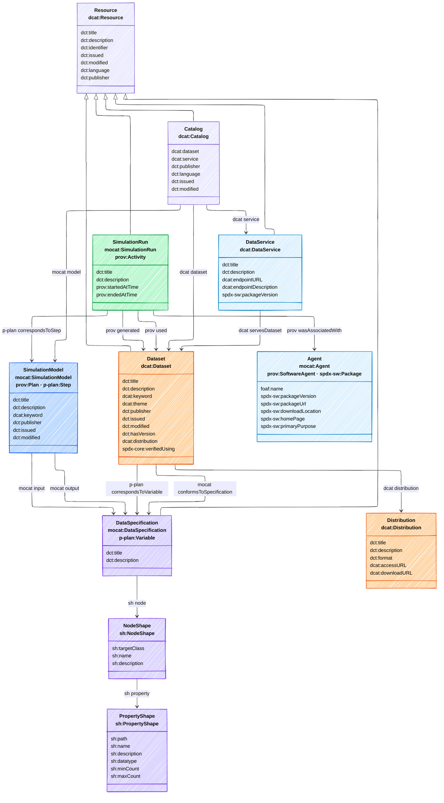

# MoCAT Ontology — Class Diagram

```mermaid
---
config:
  layout: elk
  look: handDrawn
---
classDiagram
    class Resource["Resource
      dcat:Resource"] {
        dct:title
        dct:description
        dct:identifier
        dct:issued
        dct:modified
        dct:language
        dct:publisher
    }

    class Catalog["Catalog
      dcat:Catalog"] {
        dcat:dataset
        dcat:service
        dct:publisher
        dct:language
        dct:issued
        dct:modified
    }

    class SimulationModel["SimulationModel
      mocat:SimulationModel
      prov:Plan · p-plan:Step"] {
        dct:title
        dct:description
        dcat:keyword
        dct:publisher
        dct:issued
        dct:modified
    }

    class SimulationRun["SimulationRun
      mocat:SimulationRun
      prov:Activity"] {
        dct:title
        dct:description
        prov:startedAtTime
        prov:endedAtTime
    }

    class DataSpecification["DataSpecification
      mocat:DataSpecification
      p-plan:Variable"] {
        dct:title
        dct:description
    }

    class NodeShape["NodeShape
      sh:NodeShape"] {
        sh:targetClass
        sh:name
        sh:description
    }

    class PropertyShape["PropertyShape
      sh:PropertyShape"] {
        sh:path
        sh:name
        sh:description
        sh:datatype
        sh:minCount
        sh:maxCount
    }

    class Dataset["Dataset
      dcat:Dataset"] {
        dct:title
        dct:description
        dcat:keyword
        dcat:theme
        dct:publisher
        dct:issued
        dct:modified
        dct:hasVersion
        dcat:distribution
        spdx-core:verifiedUsing
    }

    class Distribution["Distribution
      dcat:Distribution"] {
        dct:title
        dct:description
        dct:format
        dcat:accessURL
        dcat:downloadURL
    }

    class DataService["DataService
      dcat:DataService"] {
        dct:title
        dct:description
        dcat:endpointURL
        dcat:endpointDescription
        spdx-sw:packageVersion
    }

    class Agent["Agent
      mocat:Agent
      prov:SoftwareAgent · spdx-sw:Package"] {
        foaf:name
        spdx-sw:packageVersion
        spdx-sw:packageUrl
        spdx-sw:downloadLocation
        spdx-sw:homePage
        spdx-sw:primaryPurpose
    }

    style SimulationModel   fill:#BFDBFE,stroke:#2563EB,color:#000
    style SimulationRun     fill:#BBF7D0,stroke:#16A34A,color:#000
    style Dataset           fill:#FED7AA,stroke:#EA580C,color:#000
    style Distribution      fill:#FED7AA,stroke:#EA580C,color:#000
    style DataSpecification fill:#DDD6FE,stroke:#7C3AED,color:#000
    style NodeShape         fill:#DDD6FE,stroke:#7C3AED,color:#000
    style PropertyShape     fill:#DDD6FE,stroke:#7C3AED,color:#000
    style Agent             fill:#E0F2FE,stroke:#0284C7,color:#000
    style DataService       fill:#E0F2FE,stroke:#0284C7,color:#000

    %% Inheritance (rdfs:subClassOf)
    Resource <|-- Dataset
    Resource <|-- DataService
    Resource <|-- Catalog
    Resource <|-- DataSpecification
    Resource <|-- SimulationRun

    %% Relationships
    Catalog --> Dataset : dcat dataset
    Catalog --> DataService : dcat service
    Catalog --> SimulationModel : mocat model
    Dataset --> Distribution : dcat distribution
    DataService --> Dataset : dcat servesDataset
    SimulationModel --> DataSpecification : mocat input
    SimulationModel --> DataSpecification : mocat output
    Dataset --> DataSpecification : mocat conformsToSpecification
    Dataset --> DataSpecification : p-plan correspondsToVariable
    DataSpecification --> NodeShape : sh node
    NodeShape --> PropertyShape : sh property
    SimulationRun --> Dataset : prov used
    SimulationRun --> Dataset : prov generated
    SimulationRun --> SimulationModel : p-plan correspondsToStep
    SimulationRun --> Agent : prov wasAssociatedWith
```

